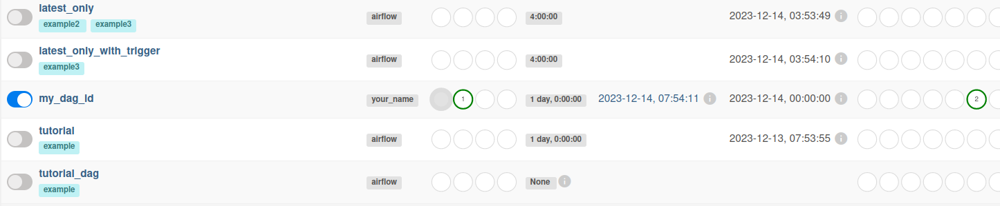

# Installing Apache Airflow on Linux

## To install anaconda
Follow the link and download the file: https://www.anaconda.com/download

The file looks like: Anaconda3-2023.09-Linux-x86_64.sh

Go to the directory where the file was installed and run it with bash:
```bash
username@ubuntu:~$ cd Downloads
username@ubuntu:~/Downloads$ bash Anaconda3-2023.09-Linux-x86_64.sh
```
Agree with everything and press Enter. Restart the terminal.

Now it looks like this:
```bash
(base) username@ubuntu:~$ 
```
## After installing conda, you can create a virtual environment using Python 3

Go to the Documents directory:
```bash
(base) username@ubuntu:~$ cd /home/username/Documents
```

Create a directory named airflow-environment and change to this directory:
```bash
(base) username@ubuntu:~/Documents$ mkdir airflow-environment
(base) username@ubuntu:~/Documents$ cd /home/username/Documents/airflow-environment
```

Create a virtual conda environment. Install Python 3.11.5 into it:
```bash
(base) username@ubuntu:~/Documents/airflow-environment$ conda create --name airflow-environment python=3.11.5
```

Activate the virtual env:
```bash
(base) username@ubuntu:~/Documents/airflow-environment$ conda activate airflow-environment
```
After activation you will see the following:
```bash
(airflow-environment) username@ubuntu:~/Documents/airflow-environment$ 
```

## Set the path to be the AIRFLOW_HOME env variable
Note, this has to be done every time you open a new terminal window and use the Airflow CLI.

Enter this into the terminal:
```bash
(airflow-environment) username@ubuntu:~/Documents/airflow-environment$ export AIRFLOW_HOME=/home/username/Documents/airflow-environment
```

## Install dependencies using this in the terminal
```bash
(airflow-environment) username@ubuntu:~/Documents/airflow-environment$ sudo apt-get update && sudo apt-get install -y python-setuptools python3-pip python-dev libffi-dev libssl-dev zip wget
```

## Install Airflow + extras using pip
```bash
(airflow-environment) username@ubuntu:~/Documents/airflow-environment$ sudo apt-get install gcc python3-dev
(airflow-environment) username@ubuntu:~/Documents/airflow-environment$ pip install apache-airflow
(airflow-environment) username@ubuntu:~/Documents/airflow-environment$ sudo pip install gcp
(airflow-environment) username@ubuntu:~/Documents/airflow-environment$ pip install statsd
(airflow-environment) username@ubuntu:~/Documents/airflow-environment$ sudo apt-get install pkg-config libxml2-dev libxmlsec1-dev libxmlsec1-openssl
(airflow-environment) username@ubuntu:~/Documents/airflow-environment$ sudo pip install sentry==2.1.2
(airflow-environment) username@ubuntu:~/Documents/airflow-environment$ pip install cryptography
(airflow-environment) username@ubuntu:~/Documents/airflow-environment$ pip install pyspark
```

## Validate Airflow installation by typing this into the terminal
```bash
(airflow-environment) username@ubuntu:~/Documents/airflow-environment$ airflow version
```
Your version should be printed. I have this: 2.7.3


# Apache Airflow on Lunux Ubuntu - Start

### Do this once, first time:

Change to folder:
```bash
cd /Documents/airflow-environment
```
Activate environment:
```bash
conda activate airflow-environment
```

Each terminal must be given:
```bash
export AIRFLOW_HOME=/home/username/Documents/airflow-environment
```

Initialize the database:
```bash
airflow db init
```
Create a user, Only do this once the first time you have set up the environment (Fill in the fields yourself):
```bash
airflow users create --role Admin --username admin --email admin --firstname admin --lastname admin --password qwe@123!
```

# To run Apache Airflow, do: 1. and 2. in seperate terminal windows

### 1. To start Airflow webserver, paste all of this in first window, and hit Enter:
```bash
cd /home/username/Documents/airflow-environment
conda activate airflow-environment
export AIRFLOW_HOME=/home/username/Documents/airflow-environment
airflow db init
airflow webserver -p 8080
```

### 2. To start Airflow scheduler, paste all of this in seconed window, and hit Enter:
```bash
cd /home/username/Documents/airflow-environment
conda activate airflow-environment
export AIRFLOW_HOME=/home/username/Documents/airflow-environment
airflow db init
export FLASK_ENV=development
airflow scheduler
```

### Now you can go to Airflow web frontend - Open in the browser (DO THIS):
```bash
localhost:8080
```

### To stop airflow webserver:
find the process id: (assuming 8080 is the port)
```bash
lsof -i tcp:8080
```
kill it
```bash
kill <pid>
```
Or Ctrl + c in the window to interrupt. (DO THIS)

# Adding your own DAGs
### To add your own DAG, go to the DAG directory where you installed airflow. For me it looks like this:
```bash
(base) username@ubuntu:~$ cd /home/username/anaconda3/envs/airflow-environment/lib/python3.11/site-packages/airflow/example_dags
```

### Create a new file named “test_dag.py” and paste your code written in Python into it:
```bash
(base) username@username:~/anaconda3/envs/airflow-environment/lib/python3.11/site-packages/airflow/example_dags$ nano test_dag.py
```

### Examle DAG:
```bash
from airflow import DAG
from airflow.operators.dummy_operator import DummyOperator
from datetime import datetime, timedelta

# Определение параметров DAG
default_args = {
    'owner': 'your_name',
    'start_date': datetime(2023, 1, 1),
    'retries': 1,
    'retry_delay': timedelta(minutes=5),
}

# Создание объекта DAG
dag = DAG(
    'my_dag_id',
    default_args=default_args,
    description='My DAG description',
    schedule_interval=timedelta(days=1),  # Расписание выполнения
)

# Определение операторов (задач) в DAG
start_task = DummyOperator(task_id='start_task', dag=dag)
end_task = DummyOperator(task_id='end_task', dag=dag)

# Определение порядка выполнения задач
start_task >> end_task
```
### Now you can run the added DAG
```bash
airflow dags trigger -e "2023-12-14" my_dag_id
```
Or do it manually via the web interface.

After launch, if no errors occur, you will see success in the field: Status of all previous DAG runs.
